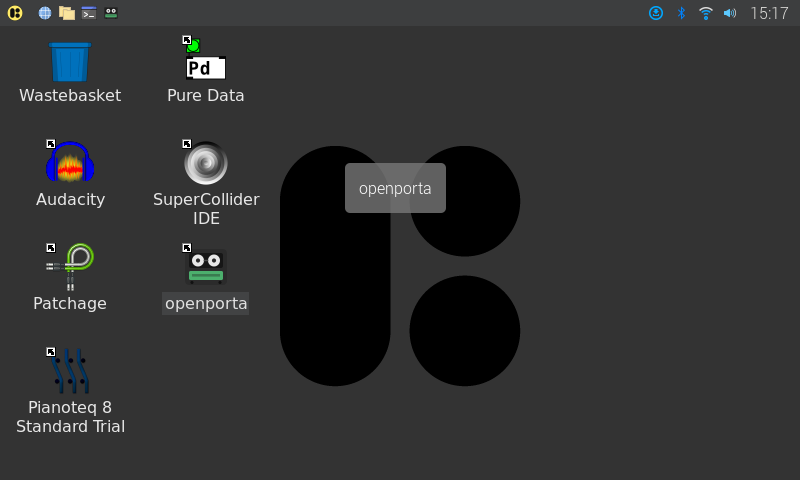

# openporta

***English** · [Español](README.es.md)*

A software emulation of a 4-track cassette portastudio.

Four mono tracks, a fixed set of controls, and a destructive workflow.
You record over things. You bounce three tracks down to one to free them
up, and the bounce costs you a generation. The constraint is the point:
this is an instrument, not a DAW.

## What it does

- **Four mono tracks, one stereo master.** No more, ever.
- **Destructive recording.** Recording over a track erases it. Bouncing
  prints the mix onto a dedicated stereo bounce bus, in real time, so
  faders and pans can be ridden while it goes down.
- **Real generation loss.** Tape character is printed at record time, so
  every bounce saturates, dulls, and wobbles the material again, and the
  noise floor climbs. Three generations sound like three generations.
- **Per-track mute and input monitor**, independent of arm - check a
  level or audition a mic before committing, silence a track without
  touching its fader.
- **Undo anyway.** The destructive feel is real, but a hidden journal
  keeps every record pass, so a mistake is recoverable. There is no
  history browser; just undo and redo.
- **Cassette character**: tape saturation, an 11kHz top end, wow and
  flutter that decorrelates between passes, and hiss printed inside the
  passband so it accumulates the way real hiss does. Bitcrush is
  available and off by default.

Out of scope, deliberately: MIDI, network sync, plugins, variable track
counts, non-destructive editing. See `openspec/spec.md`.

## Screenshots

Running live on the deployment target - a Raspberry Pi 4 with a Zoom L6
interface, in kiosk mode:


Track strips (arm/mute/monitor, vertical fader and meter, pan), the tape
position bar under the counter, and a live device connection - no mouse
needed, this is running full-screen with a touchscreen in mind. The
Tapes view (cassette picker, free-space indicator, export) and Settings
view (device selection, kiosk toggle) sit behind two buttons on this
same screen, kept off it by default so the mixer fits an 800x480 kiosk
display without scrolling.



It also lives as an ordinary desktop app - taskbar launcher, desktop
icon - for anyone who wants to start it manually instead of booting
straight into kiosk mode.

## Status

The engine is complete and headlessly tested. The Slint UI drives it
through the command queue; with the `realtime` feature on and a device
connected, it's a real cpal audio path end to end, verified against a
Zoom L6 on both macOS and a Raspberry Pi 4.

| Milestone | State |
|-----------|-------|
| M0 scaffolding, CI, test instruments | done |
| M1 tape engine: transport, record, punch, undo, persistence | done |
| M2 lo-fi DSP and generation loss | done |
| M3 bounce, mixdown, WAV export, CLI | done |
| M4 realtime audio (cpal) | verified on macOS and Pi hardware |
| M5 Slint UI: transport, track strips (arm/mute/monitor/fader/pan), meters, tape position bar, save/undo, cassette Tapes view, export, real audio | done |
| M7 stereo bounce bus (change 001) | done - shipped in v0.1.0 |
| M6 Raspberry Pi deployment | in progress - aarch64 build, ALSA/PipeWire device layer, full-duplex record/save, remembered-device auto-connect, kiosk auto-launch with taskbar/desktop icons, and autosave-on-stop all verified on real hardware; performance profiling (M6.2) still open |

Three separate realtime-safety bugs have been found and fixed here,
none of them by a crash: recording allocated a whole-tape-sized buffer
on the audio callback thread; an eviction path dropped its pre-reserved
chunks back to the heap instead of returning them; and engaging
recording rebuilt the entire DSP chain - four or five allocations -
every time, unnoticed for months. Each was caught by adversarial review
and fixed with a regression test.

The proposal for a dedicated stereo bounce bus
(`openspec/changes/001-stereo-repeatable-bounce.md`) was **approved
after twelve rounds of review across thirteen revisions**, every round
but the last finding a real bug or gap. It is folded into
`openspec/spec.md` (v1.1) and fully implemented: real-time stereo
printing, atomic two-channel undo, bounces that fold forward instead of
replacing, the master fader provably never reaching tape, and a Bus
strip in the UI with its own fader and mute.

REQ-902 is measured rather than argued: a test-only counting global
allocator asserts **zero allocations and zero deallocations** across
`record -> process_block -> stop`, for both a track pass and a bounce.
The first time it ran it found four more violations that careful
reasoning had missed.

Today you drive it through session scripts, the CLI, or the UI.
`TASKS.md` is the queue.

## Try it

```bash
# make a cassette and record something onto track 1
cargo run -p porta-app -- new mytape.porta --minutes 5
cargo run -p porta-app -- script session.json
cargo run -p porta-app -- render mytape.porta --out mix.wav --bits 24
```

A session script is a list of ops:

```json
{"ops": [
  {"op": "new", "dir": "mytape.porta", "minutes": 5, "seed": 1979},
  {"op": "arm", "track": 0},
  {"op": "record", "input_wav": "guitar.wav"},
  {"op": "arm", "track": 0, "on": false},
  {"op": "fader", "track": 0, "db": -3.0},
  {"op": "pan", "track": 0, "value": -0.4},
  {"op": "bounce_arm"},
  {"op": "seek", "seconds": 0},
  {"op": "bounce", "seconds": 30},
  {"op": "bounce_arm", "on": false},
  {"op": "seek", "seconds": 0},
  {"op": "export", "out": "discard.wav"},
  {"op": "play", "seconds": 30},
  {"op": "export", "out": "mix.wav"},
  {"op": "save"}
]}
```

`export` writes whatever the machine has played since the previous
export, which is why the example throws one away before the take it
wants. `character` on the `new` op accepts `cassette` (default) or
`clean`, the latter being useful when you want the mechanics without the
colour.

With real audio hardware:

```bash
cargo run -p porta-app --features realtime -- devices
cargo run -p porta-app --features realtime -- live mytape.porta --period 256
```

The Slint UI, with real audio if the `realtime` feature is on too:

```bash
cargo run -p porta-app --features ui,realtime -- ui mytape.porta
# --kiosk runs full-screen and frameless, for a dedicated touchscreen -
# Escape toggles it off, or flip the same switch from the Settings view
cargo run -p porta-app --features ui,realtime -- ui mytape.porta --kiosk
```

The UI remembers the last audio device that connected successfully and
reconnects to it automatically on launch - it's meant to behave like an
appliance that's ready when it's turned on, not a tool that starts idle.
`docs/pi-setup.md` covers kiosk autostart, the taskbar launcher, and the
desktop icon on the Pi specifically.

## Releases

Tagged releases (`vX.Y.Z`) build `porta-app` for macOS (Apple Silicon
and Intel), Linux (x86_64 and aarch64), and Windows, with both the
`realtime` and `ui` features on - see the Actions tab, or
`.github/workflows/release.yml`.

## Layout

```
crates/porta-dsp/      tape character: saturation, bandwidth, flutter, hiss
crates/porta-engine/   tape, transport, record passes, undo, mixer, projects
crates/porta-testkit/  test instruments: generators, meters, FFT, click detector
crates/porta-app/      CLI, session scripts, WAV export, realtime adapter, Slint UI
openspec/spec.md       the settled requirements
openspec/changes/      proposals to change settled requirements, under review
docs/manual-checklist.md  what only a human with hardware can verify
docs/pi-setup.md       kiosk autostart, taskbar launcher, desktop icon
```

The engine knows nothing about audio hardware: buffers in, buffers out.
That is what lets the whole thing be tested without a sound card, and
what lets it run on a Pi without the engine noticing.

## Development

```bash
cargo fmt --check && cargo clippy --workspace --all-targets -- -D warnings && cargo test --workspace
```

On a machine with no Rust toolchain, `scripts/cargo-docker.sh` runs the
same commands in a container.

Audio correctness is verified by rendering offline and measuring:
RMS windows, band energy, total harmonic distortion, pitch deviation in
cents, and a click detector that catches discontinuities no listener is
present to hear. One golden render pins the exact sound of a full
session; if it changes, something changed, and the reason belongs in
`TASKS.md` before it is blessed.

## A cassette on disk

```
mytape.porta/
  manifest.json        tape length, character and seed, mixer settings
  tape/track{0..3}.raw raw 16-bit samples, saved in 5-second chunks
  tape/bounce_{l,r}.raw the stereo bounce bus, same chunked format
  undo/                the journal that makes undo possible
```

Saves rewrite only the chunks that changed, and never happen while the
tape is rolling.
