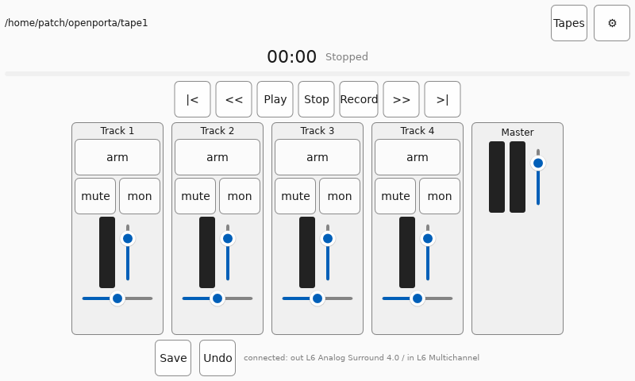

*[English](../index.html) · **Español***

# openporta

Una emulación por software de un portaestudio de casete de 4 pistas,
escrita en Rust.

Cuatro pistas mono. Un master estéreo. Un conjunto de controles fijo y
reducido. Un flujo de trabajo destructivo: grabar sobre una pista la
borra, y mezclar tres pistas a una te cuesta una generación de siseo y
fluctuación de cinta, igual que siempre pasó con el aparato real. La
limitación es el punto. Esto es un instrumento, no una DAW, y no
pretende convertirse en una.

## Por qué

Los portaestudios de casete de cuatro pistas imponían un tipo de
compromiso que el software moderno vuelve fácil de evitar: deshacer
sale caro, las pistas escasean y cada mezcla degrada el material de
verdad. Esa escasez nunca fue una limitación que los músicos toleraban:
era parte del instrumento. openporta reconstruye ese instrumento en
software, para quienes quieren el sonido y el flujo de trabajo sin
mantener hardware de hace 40 años, en lugar de construir otra DAW
infinitamente flexible.

## Qué tiene realmente

- **Cuatro pistas mono, un master estéreo. Nunca más que eso.** No es
  configurable. Agregar una pista no es una solicitud de función, es
  otro producto.
- **Grabación destructiva**, tal como la cinta siempre lo fue. El
  pinchado de entrada y salida (punch-in/punch-out) usa un crossfade
  real de 5ms para que nunca suene un clic, pero lo que se sobrescribe
  desaparece de verdad de la cinta: solo un historial de deshacer
  oculto, no visible, lo recupera.
- **Pérdida de generación real.** Cada pasada de grabación - incluida
  una mezcla - atraviesa una cadena de señal lo-fi completa antes de
  llegar a la cinta (virtual): saturación, un techo estrechado a 11kHz,
  wow y flutter que se descorrelacionan entre pasadas para que las
  generaciones sucesivas no repitan la misma fluctuación, y siseo
  sembrado dentro de la banda de paso para que se acumule como lo hace
  el ruido analógico real. Mezclá tres generaciones y vas a escuchar
  tres generaciones: esa es la prueba de aceptación que el motor tiene
  que pasar, no un detalle deseable.
- **Silencio (mute) y monitor de entrada por pista**, independientes
  del armado: revisá un nivel o escuchá un micrófono antes de
  comprometerte, silenciá una pista sin tocar su fader.
- **Una barra de posición de cinta, medidores y un mezclador que entran
  en una pantalla táctil chica** sin mouse. Controles táctiles de alto
  contraste dimensionados para dedos, no para la precisión de un
  puntero.

Deliberadamente fuera de alcance: MIDI, sincronización por red,
plugins, cantidad variable de pistas, edición no destructiva, cualquier
cosa que empiece a convertir esto de nuevo en una DAW. Mirá la
especificación establecida del proyecto si querés el límite exacto y
aplicado.

## Dónde corre

El motor en sí no sabe que existe el hardware de audio: son buffers que
entran y buffers que salen, y eso es lo que hace posible probarlo sin
placa de sonido y correrlo idénticamente en una laptop o en una
[Raspberry Pi](raspberry-pi.html) que arranca directo en modo kiosco
como instrumento dedicado. Mirá [Primeros pasos](getting-started.html)
para la CLI y el camino de los guiones de sesión, o la página de
[Raspberry Pi](raspberry-pi.html) para ver cómo queda como un equipo
dedicado de verdad.

## Más

- [Primeros pasos](getting-started.html) - cómo correrlo, la CLI,
  guiones de sesión.
- [Cómo está construido](architecture.html) - el motor, la cadena de
  DSP, seguridad en tiempo real, cómo se prueba la corrección sin
  alguien escuchando.
- [Configuración de Raspberry Pi](raspberry-pi.html) - modo kiosco,
  teclado en pantalla, los íconos y lo que costó hacer funcionar todo
  eso en hardware real.
- [Estado](status.html) - qué está hecho, qué está en curso y cómo se
  toman los cambios a decisiones ya establecidas.
